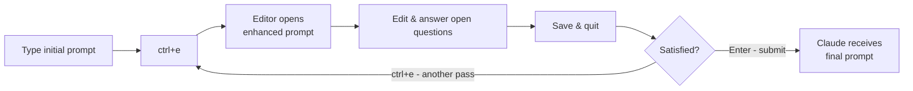

# enhance

A Claude Code skill that adds AI-powered prompt enhancement to the chat input via `ctrl+e`.

## What it does

Pressing `ctrl+e` while typing a prompt intercepts the text, sends it to Claude for a quick rewrite pass, then opens the result in `$EDITOR` for review. You can edit further before submitting. If the prompt is empty, it skips enhancement and opens a blank editor directly.

This gives you a lightweight editing loop: draft quickly, hit `ctrl+e`, review the cleaned-up version, and send.



## Usage

Run `/enhance` in Claude Code to install or update the feature. The skill checks that the script is executable and that `settings.json` is wired up correctly, then reports what it did.

After that, the feature is always on. No further invocation needed.

### Controls

| Action | Effect |
|--------|--------|
| `ctrl+e` | Enhance the current prompt (or open editor if empty) |
| Save and exit `$EDITOR` | Submit the edited prompt |
| Close `$EDITOR` without saving | Discard changes |

## How it works

Claude Code's `chat:externalEditor` action reads `VISUAL` from `settings.json`, writes the current prompt to a temp file, and calls `$VISUAL <tmpfile>`. The `micro-enhance` script is set as that `VISUAL` program.

Flow when `ctrl+e` is pressed:

1. **Empty prompt** - opens `$EDITOR` directly, no API call.
2. **Non-empty prompt** - calls `claude -p` with the contents of `enhance-prompt.txt` prepended to the prompt text. On success, writes the rewritten text back to the temp file. On failure, writes a `# [Enhancement failed]` comment above the original. Either way, opens `$EDITOR` for review.
3. **Editor closes** - Claude Code reads the (possibly modified) temp file and puts it back in the input.

## Files

```
~/.claude/skills/enhance/
├── SKILL.md                     # Skill definition (read by Claude Code)
├── README.md                    # This file
└── scripts/
    ├── enhance                  # The VISUAL program called on ctrl+e
    └── enhance-prompt.txt       # System prompt used for the rewrite call
```

The `VISUAL` environment variable in `~/.claude/settings.json` points directly at `scripts/micro-enhance`. There is no copy elsewhere. Edits to the script take effect immediately without reinstalling.

## Configuration

The script opens whatever editor is set in `$EDITOR`. `micro` is recommended - it handles word wrap well and has a clean save-and-quit flow for short text. The sections below cover `micro`-specific setup; skip them if you're using a different editor.

Four files need to be in the right state for the feature to work end-to-end.

### `~/.claude/settings.json` - VISUAL env var

Claude Code reads `VISUAL` from the `env` block to know which program to call when `chat:externalEditor` fires. Without this entry the keybinding does nothing.

```json
{
  "env": {
    "VISUAL": "~/.claude/skills/enhance/scripts/micro-enhance"
  }
}
```

Running `/enhance` sets this automatically if it is missing or points to the wrong path.

### `~/.claude/keybindings.json` - ctrl+e binding

The keybinding file maps `ctrl+e` in the `Chat` context to the `chat:externalEditor` action, which is what invokes `VISUAL`.

```json
{
  "bindings": [
    {
      "context": "Chat",
      "bindings": {
        "ctrl+e": "chat:externalEditor"
      }
    }
  ]
}
```

This binding is not installed by `/enhance` - it must be present independently. If `ctrl+e` does nothing, check this file first.

### `~/.config/micro/settings.json` - micro editor options (if using micro)

Controls micro's behavior when it opens the temp file. The settings relevant to this feature:

```json
{
  "wordwrap": true
}
```

`wordwrap: true` keeps long prompts readable without horizontal scrolling. This is a user-level micro setting; it applies globally, not just to this feature.

### `~/.config/micro/bindings.json` - micro exit shortcut (if using micro)

By default, saving and quitting micro requires `ctrl+s` then `ctrl+q`. If you have a combined save-and-quit binding (for example `"Ctrl-x": "Save,Quit"`), that shortcut works here too.

No specific binding is required for this feature, but having a quick exit shortcut makes the review step less disruptive.

---

**Summary table**

| File | What it controls | Set by `/enhance`? |
|------|-----------------|-------------------|
| `~/.claude/settings.json` | `VISUAL` path that Claude Code calls on `ctrl+e` | Yes |
| `~/.claude/keybindings.json` | `ctrl+e` → `chat:externalEditor` binding | No |
| `~/.config/micro/settings.json` | Word wrap behaviour in micro (if using micro) | No |
| `~/.config/micro/bindings.json` | micro keyboard shortcuts, e.g. save-and-quit (if using micro) | No |

## Dependencies

- **Claude Code CLI** (`claude`) - called headlessly via `-p` for the rewrite
- **A terminal editor** - whatever `$EDITOR` is set to; `micro` is recommended

## What the enhancement prompt does

`enhance-prompt.txt` instructs Claude to rewrite the prompt so it is clear, concise, well-structured, typo-free, and unambiguous. Sentences are separated by line breaks. Any undefined terms or acronyms are flagged in an **Open questions** section at the end. Claude returns only the rewritten prompt with no preamble.

## The pattern this borrows from

The enhance flow is a version of **reflective listening**, also called **active listening** or paraphrasing: Person A hears Person B, restates the statement in their own words, and only then responds. The restatement catches misunderstandings before they cost anything.

Here, Claude plays Person A. It reads the draft prompt, rewrites it as a clearer version, and flags ambiguities as Open questions. You confirm or correct the restatement before it becomes the prompt that drives real work.

The technique shows up wherever the cost of a misunderstanding is high:

* Therapy and counseling, where Carl Rogers built person-centered therapy around it in the 1940s and 1950s. 
* Medicine, where "teach-back" protocols have clinicians restate symptoms or instructions to catch errors before they reach the patient. 
* Crisis negotiation, where the FBI calls it "mirroring" and "labeling" and trains it as a de-escalation tool. 
* Mediation, where each party's position is restated before the other gets to respond. 
* Coaching, sales, and customer success, where "so what I'm hearing is..." opens the way to consultative work. 
* Aviation uses a stricter form: pilots read ATC clearances back verbatim, and nuclear, military, and maritime operations follow similar repeat-back protocols. 
* Software engineering interviews coach candidates to restate the problem before writing code. 
* Teacher training (especially early childhood and special education) includes reflective listening for parent conferences and student support. 
* Diplomats and consecutive interpreters use a structured version to slow exchanges and surface nuance.

Drafting a prompt has the same cost structure. A misread question wastes a turn, or worse, sends real work in the wrong direction. The enhance step is where you catch that.

### Further reading

* Foundational - [Rogers, C. R., & Farson, R. E. (1957). *Active Listening*.](https://www.gordontraining.com/free-workplace-articles/active-listening/)
* Therapy and counseling - [Rogers, C. R. (1951). *Client-Centered Therapy*.](https://en.wikipedia.org/wiki/Person-centered_therapy)
* Medicine - [AHRQ. *Use the Teach-Back Method: Tool 5*.](https://www.ahrq.gov/health-literacy/improve/precautions/tool5.html)
* Crisis negotiation - [Voss, C. (2016). *Never Split the Difference*.](https://en.wikipedia.org/wiki/Never_Split_the_Difference)
* Mediation - [Fisher, R., & Ury, W. (1981). *Getting to Yes*.](https://en.wikipedia.org/wiki/Getting_to_Yes)
* Coaching, sales, customer success - [Covey, S. R. (1989). *The 7 Habits of Highly Effective People*, Habit 5.](https://en.wikipedia.org/wiki/The_7_Habits_of_Highly_Effective_People)
* Aviation - [FAA. *Aeronautical Information Manual*, §5-5: Pilot/Controller Roles and Responsibilities.](https://www.faa.gov/Air_traffic/publications/atpubs/aim_html/chap5_section_5.html)
* Software engineering interviews - [McDowell, G. L. (2015). *Cracking the Coding Interview*.](https://en.wikipedia.org/wiki/Cracking_the_Coding_Interview)
* Teacher training - [Gordon, T. (1974). *Teacher Effectiveness Training*.](<https://en.wikipedia.org/wiki/Thomas_Gordon_(psychologist)>)
* Diplomats and interpreters - [Gillies, A. (2017). *Note-taking for Consecutive Interpreting* (2nd ed.).](https://www.routledge.com/Note-taking-for-Consecutive-Interpreting-A-Short-Course/Gillies/p/book/9781138123205)
